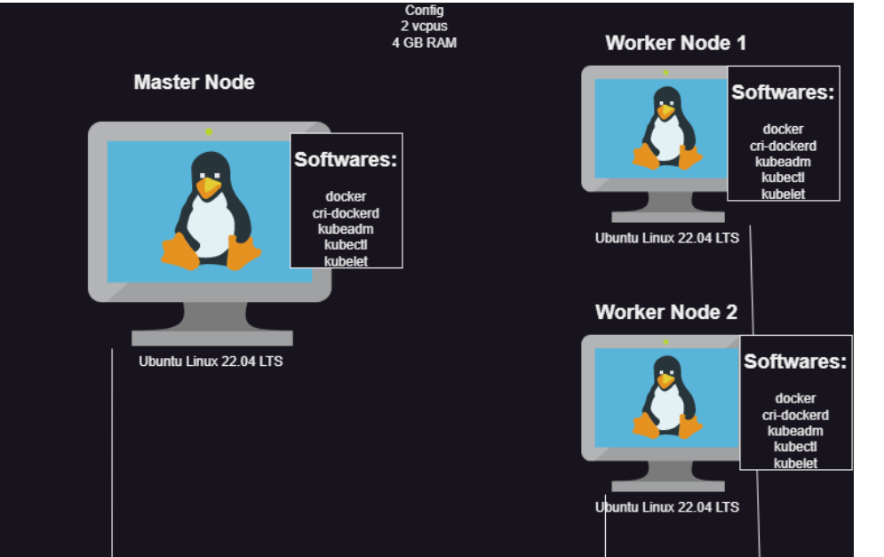

# Manual steps to install kubernetes

* create 2 vms and login 
###  ----steps to be done in both the nodes----

1. install DOCKER in both the vms
[Refer here](https://get.docker.com/)
   - $ curl -fsSL https://get.docker.com -o install-docker.sh
   - $ sh install-docker.sh

 * now docker info
   - $ docker info      (## unix:///var/run/cri-dockered.sock)
    
 * now check docker version - server version wil be denied 
   - $ docker version
 * add ubuntu user to docker group
   - $ sudo usermod -aG docker ubuntu
 * logout and login
   - $ logout
2. To install CRI-dockerd and get the latest releases
[Refer here](https://github.com/Mirantis/cri-dockerd/releases)
   - $ wget https://github.com/Mirantis/cri-dockerd/releases/download/v0.3.4/   cri-dockerd_0.3.4.3-0.ubuntu-jammy_amd64.deb
   - $ sudo dpkg -i cri-dockerd_0.3.4.3-0.ubuntu-jammy_amd64.deb     (### dabean package )

3.  Install kubeadm, kubectl and kubelet on 2 nodes 
[Refer here](https://kubernetes.io/docs/setup/production-environment/tools/kubeadm/install-kubeadm/#installing-kubeadm-kubelet-and-kubectl)

   1. Update the apt package index and install packages needed to use the Kubernetes apt repository:
      - $ sudo apt-get update
      # apt-transport-https may be a dummy package; if so, you can skip that package
      - $ sudo apt-get install -y apt-transport-https ca-certificates curl
   2. Download the public signing key for the Kubernetes package repositories. The same signing key is used for all  repositories so you can disregard the version in the URL:
      - curl -fsSL https://pkgs.k8s.io/core:/stable:/v1.28/deb/Release.key | sudo gpg --dearmor -o /etc/apt/keyrings/kubernetes-apt-keyring.gpg
   3. Add the appropriate Kubernetes apt repository:
      # This overwrites any existing configuration in /etc/apt/sources.list.d/kubernetes.list
      - $ echo 'deb [signed-by=/etc/apt/keyrings/kubernetes-apt-keyring.gpg] https://pkgs.k8s.io/core:/stable:/v1.28/deb/ /' | sudo tee /etc/apt/sources.list.d/kubernetes.list
   4. Update the apt package index, install kubelet, kubeadm and kubectl, and pin their version:
      - $ sudo apt-get update
      - $ sudo apt-get install -y kubelet kubeadm kubectl
      - $ sudo apt-mark hold kubelet kubeadm kubectl

# ---Execute the following on master node---

4. Now Lets create a k8s cluster using kubeadm 
[Refer here](https://kubernetes.io/docs/setup/production-environment/tools/kubeadm/create-cluster-kubeadm/)

5. Lets initialize the cluster using the following command as a root user
    - $ sudo -i
    - $ kubeadm init --pod-network-cidr "10.244.0.0/16" --cri-socket "unix:///var/run/cri-dockerd.sock"

6. On the master node to run kubectl as regular user execute the following
    - $ mkdir -p $HOME/.kube
    - $ sudo cp -i /etc/kubernetes/admin.conf $HOME/.kube/config
    - $ sudo chown $(id -u):$(id -g) $HOME/.kube/config

7. Now as a regular user execute kubectl get nodes    
   - $  kubectl get nodes

# ---Execute the command in worker node---

8. Now as a root user in workernode execute the join command  
     # we will get after initialise step

   - $ kubeadm join 172.31.13.69:6443 --token t0hkv6.es6qexws9lhbbi5x \
        --discovery-token-ca-cert-hash sha256:d80f37bfb0dc701380dc1fb816cda39b91e84b841b3263d954c141507ae6929a \
        --cri-socket "unix:///var/run/cri-dockerd.sock" 

# ---execute in master node---

9. Now execute kubectl get nodes from master node
   - $ kubectl get nodes

10. Now kuberentes needs CNI Plugin so that pod-network is enabled. Till this is done the DNS doesnot work, services donot work so nodes are shown as NotReady.
11. We can choose among wide range of CNI Plugins, For this lets use flannel. Execute the following on master node
  - $  kubectl apply -f https://github.com/flannel-io/flannel/releases/latest/download/kube-flannel.yml

12. Now execute kubectl get nodes -w and wait for all the nodes to get to ready state
  - $ kubectl get nodes -w

    
