# Kubernetes

* Kubernetes (k8s) is an open source orchestrator for deploying containerized applications.
* Kubernetes is a platform that manages container-based applications, their networking and storage components.

### Cluster: 
Cluster is collection of compute, storage and networking resources that Kubernetes uses to run workloads.

### Kubernetes cluster can be created in 2 ways
1. mannual installation 
  - we install required softwares in a virtual machine and nodes
2. using cloud Kubernetes services
  1. Azure Kubernetes Services(AKS)
  2. Amazon Elastic Kubernetes Service (Amazon EKS)  
  3. Google Kubernetes Engine (GKE)
3. CLI (through yamlfile)
4. Using Terraform  

###  Azure Kubernetes Services(AKS)
#### Steps to create aks
1. Basic
2. Node Pools
3. Networking
4. Integrations
5. Advanced
6. Tags
7. Review+create


### K8s provides the following features
  * Development Velocity
  * Scaling
  * Abstract your infrastructure
  * Self Healing
  * Declarative Approach

### Architecture
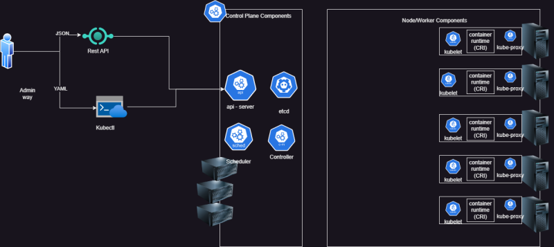

## softwares to be installedfor azure kubernetes services

- install azure-cli
  `choco install azure-cli`
  `choco install kubernetes-cli`
  `az login`
  `az aks get-credentials`
   
  
  - install eks:
   * install awscli
   `choco install awscli -y`
   `choco install eksctl -y`
   `aws configure`
   `aws s3 ls`  
   - #list of s3 buckets

   * Command Line Interface (CLI)
   - [Referhere](https://eksctl.io/usage/creating-and-managing-clusters/)

* To create in eks we need to add the yaml file in the repository
```
apiVersion: eksctl.io/v1alpha5
kind: ClusterConfig

metadata:
  name: supriya-cluster
  region: us-east-1

nodeGroups:
  - name: node1
    instanceType: t3.medium
    desiredCapacity: 2
 ```
* to create cluster 
- `eksctl create cluster -f <yamlfilename>`
* go to instaces and check for worker nodes
- `eksctl delete cluster -f <yamlfilename>`


### Understand K8s resources 
### Pod:
 Pod is atomic unit of creation in k8s and it contains container(s). Each Pod has unique ip address
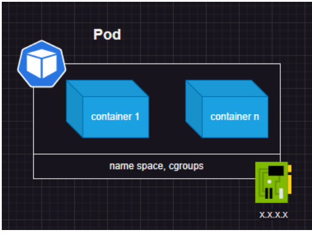

### Replicaset: 
 maintaines the state of the pods.If the pod dies it runs the pods on new nodes.

### Label: 
This is name/value pair used to query resources in k8s. used in services, replicasets, deployments etc…
* kubernetes identifies all the resources with the help of lables.

### Controllers:
Replication Controller or Replica Set: They maintain a state of number of replicas of pods
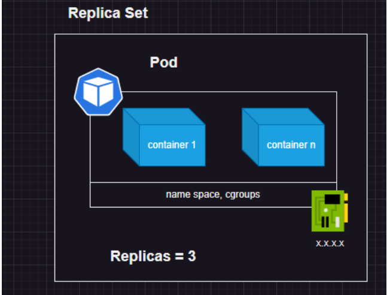

### Deployment:
This enables performing zero downtime deployments with features to rollout a new version and undo rollout
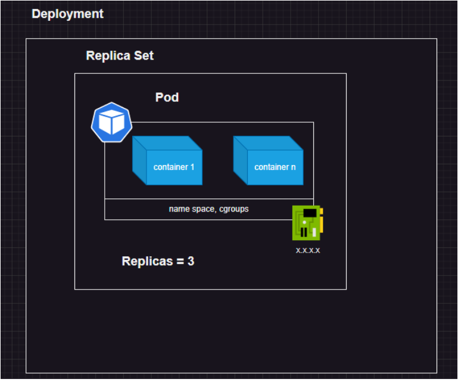

### Horizontal Pod AutoScaler:
Allows us to autoscale pods based on some metrics like cpu, network etc…

### there are 2 ways of creating resources
1. Imperatively: 
     `kubectl run nginx --image nginx`
2. Declaratively
     Create a yaml file with below content and execute
     `kubectl apply -f <filename.yaml>`    
     `kubectl delete -f <filename.yaml>`   
### Creating Pod Manifests
* The basic skeleton manifest which is suitable for majority of resources

```
---
apiVersion:
kind:
metadata:
spec:
```
* This when executed becomes 5 as k8s will add status

```
---
apiVersion:
kind:
metadata:
spec:
status:
```

### 1.apiVersion
 - note: if the apiGroup is not core
apiVersion: <apiGroup>/<version>

 - if the apiGroup is core
apiVersion: <version>

### 2.kind
controller type eg: pods, replicset,replication controller, cronjob etc

### 3. metadata
This helps in naming and labelling resources in k8s

### 4. spec
This contains the details about the object. For example, for a pod, it would contain which container image it would run, the ports to expose, the labels, and more.

### Note: 
* if you have string write in same line.
* if you have to go inside the resource go to next line and give 2 spaces.
* if you have array for thr resource go to next line  give 2 spaces and a hifen "-" and 1 space.

### steps to run a manifest yaml

1. create an file with yaml extensions
2. to see weather the nodes are ready 
   * `kubectl get nodes`
3. now to create and run pods
   * `kubectl apply -f <name.yaml>`
#### lets run a manifset
```
---
apiVersion: v1
kind: Pod
metadata:
  name: hello-pod
spec:
  containers:
    - name: webserver
      image: nginx:1.25
```
*  `kubectl get nodes`
*  `kubectl apply -f nginx.yaml`  
*  `kubectl get pods` 
   - list of pods
*  `kubectl get pods -w`      
   - to watch internal functionality
*  `kubectl get pods -o wide` 
   - shows the output with more information
*  `kubectl api-resources`   
   - Kubernetes allows us to view all the resources using kubectl
*  `kubectl describe pod`      
   - show what happends in side the pod
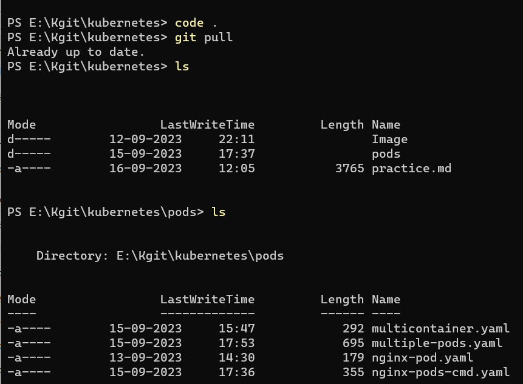
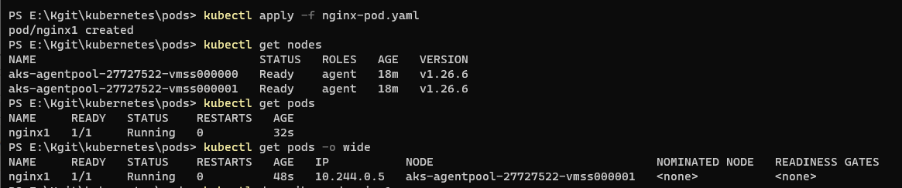
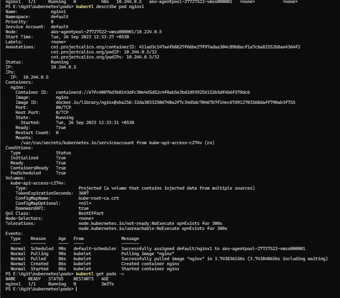


### Note: 
In kubernetes we can not run two containers which use the same port in one pod.

### Scaling: 
Scaling in k8s means increasing number of Pods not containers in Pod. For Scaling pods we would learn Replica set/Replication Controller etcs..

### Label
* Lable is a key pair examples are
```
     app: nginx
     version: v1.0
```
* Labels are used to select/query kubernetes objects
* Labels are just like stickers. Name of the label does not have any functionality that is running inside the container.
* Labels are given just to identify quicker the objects.

`kubectl get pods --show-label`
* shows all pods with lables
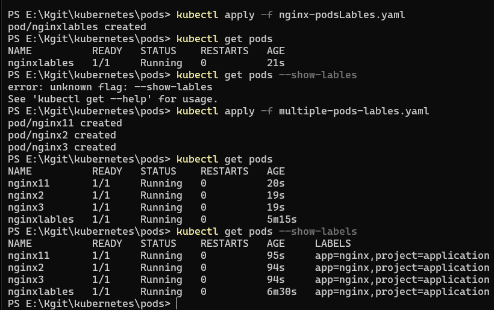

### Selector: 
* Selectors in k8s help in querying objects using labels
* selectors are of two types
   1. Equality Based Selectors
      - supports only equal and not equal lables as shown below it supports only app=nginx
   2. Set based selectors
      - supports more than one labels gives more flexibity
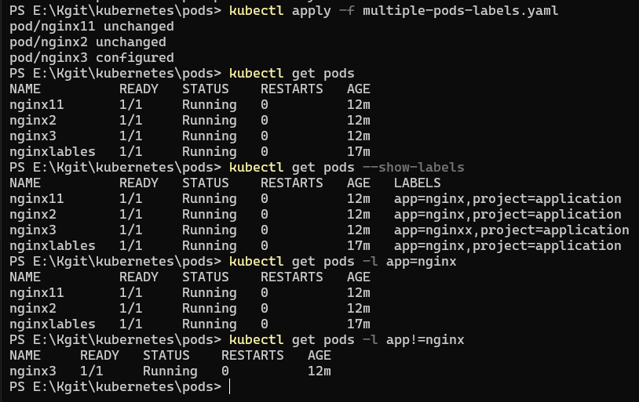

### Interacting with containers:
* In docker `docker container exec -it` or `docker container exec`
* In k8s we have `kubectl exec <pod name> -- <...>` 
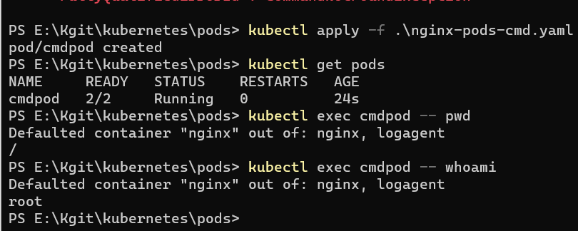

* when we deal with multiple containers and we want to access one container in them the command is 
- `kubectl exec <pod-name> -c <conatiner-name> -- <...>`

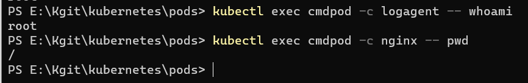
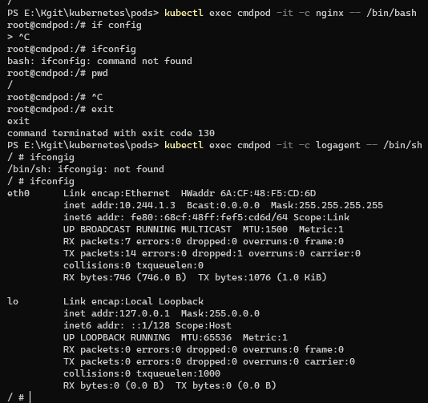

### trying a container which exits and see the result:

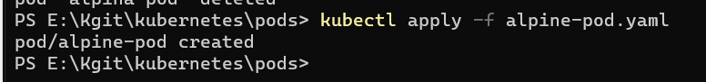
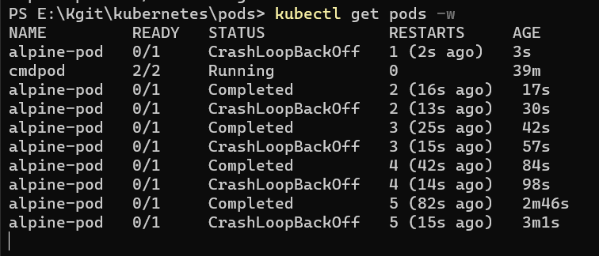

### * Crashloopbackoff: 
when the container gets exited the kubernetes shows "crashloopbackoff" 
* kubernetes tries to restart the container in side the pod when ever it gets exited.

### * restartPolocy:
there are three functionalities
- never
- onfailure
- always

* in the below example i have put never so kubernetes does not restart the container
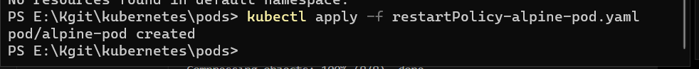
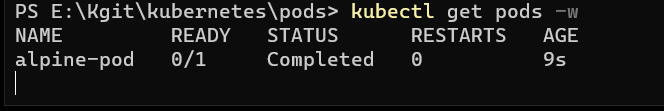

### Container types in Pod
#### 1.Init containers:
 These containers are created prior to actual/main containers. ideally these containers should be short lived and majorly for meeting preconditions to run your application. 
#### 2.Containers:
 This is where we run actual applications and they are expected to be living forever (continously).

 * init containers run one after the other , where as main containers run parallely.
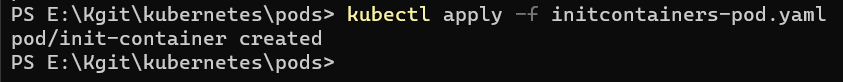
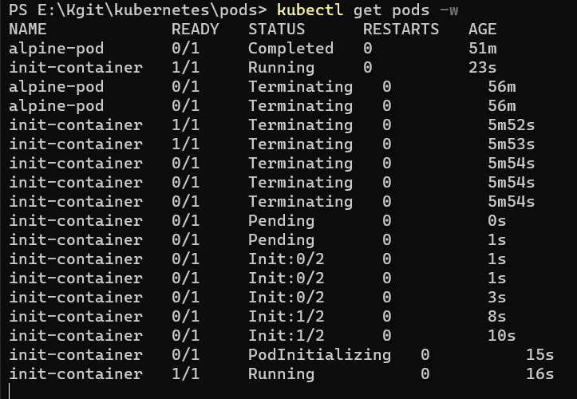

### ---Activity---
1. Create a nginx container with 128 MB of RAM
2. Create a jenkins continer with “0.5” cpu and 256 MB of RAM
```
docker container run  -P -d  --memory 128m nginx
docker container run --name r-memcpu-jenkins -P -d --cpus="0.5" --memory 256m jenkins/jenkins
docker stats 
```

### lets write a manifest for this in kubernetes
### Resource Restrictions in Pods :
Limits in Resoruce Restrictions mean maximum size that will be allocated (upper bounds/limits) and request are lower limits

### Controllers: 
* Pod tries to keep containers running, but for us we need to keep Pods running according to some state, Lets understand first two categories
### - Replicas:
Here we have two resources ReplicationController, ReplicaSet
#### * ReplicationController:
This is the old version of the controllers.They only support equality based controllers.
#### * ReplicaSet:
Replicaset is the new version. They supproy both set based and equality based controllers.

- Here our desired state (spec) will be
1. number of replicas
2. pod spec
3. label selector
- These objects try maintain the desired

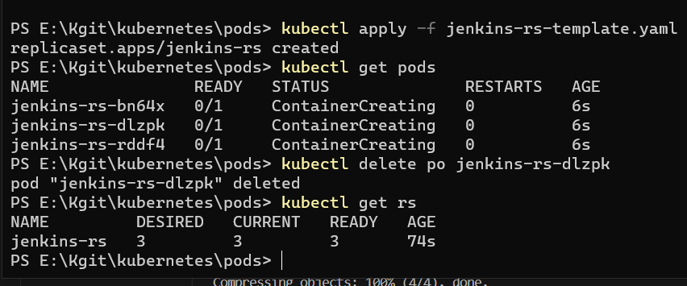
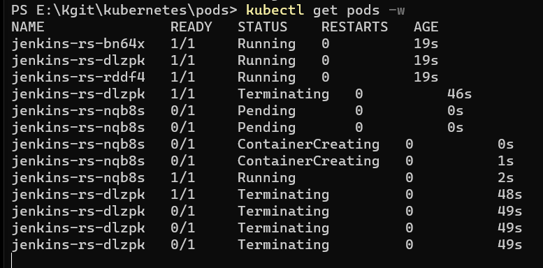

#### * Creating 2 pods and running replicaset yaml to see the desired state
* creating 3 nginx containers with 2same labels ,1 different label and running the replicaset of count 3 yaml 
```
     app: jenkins
     version: v1
```
  - Kubernetes will only create 2 pods, As there is one pod of nginx with same labels.
  ### Note: By this we can conclude that kubernetes will maintain their state of replicas with the matching labels irrespective of what container is running inside the pod.

### Selectors are of 2 types
#### 1. MatchLables:
These select only equity based labels.i.e, only equal and not equal labels are supported.  

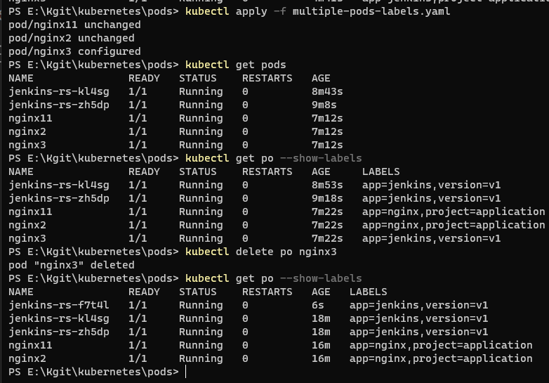
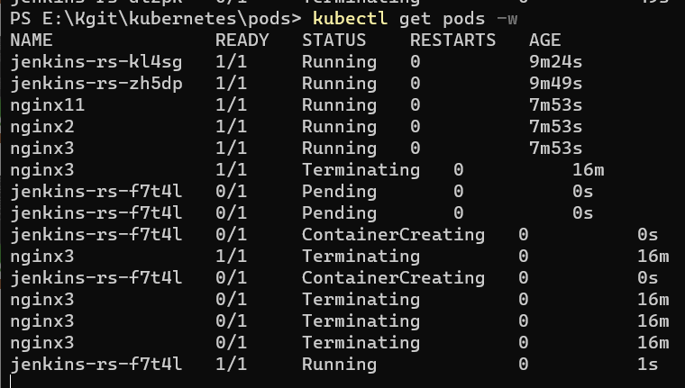

#### 2. MatchExpressions:
These gives more flexibility where they support labels irrespective of value in the labels
1. key
2. Operator
3. values

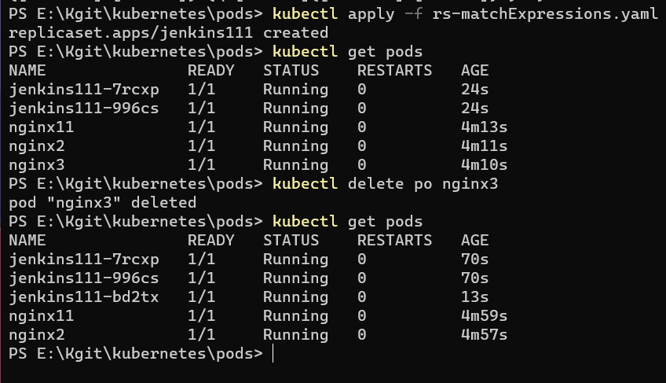
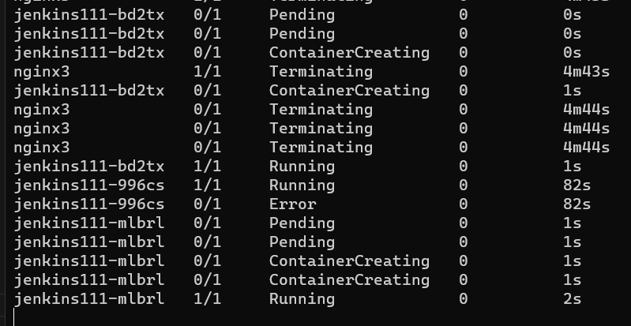

- `kubectl get rs`

### Jobs and Cron Jobs:

* Lets write a Cron Job which runs alpine pod with some script for every min.

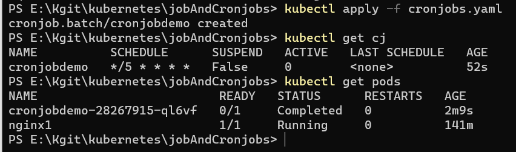
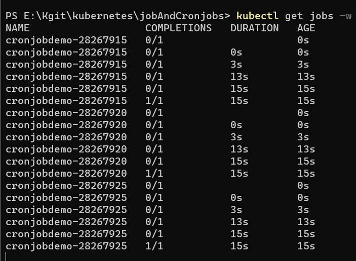
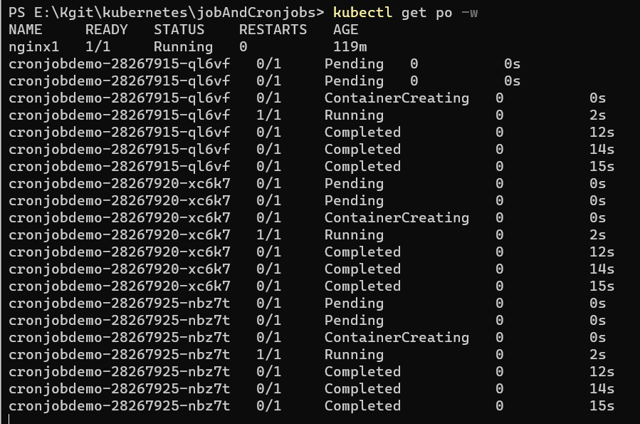
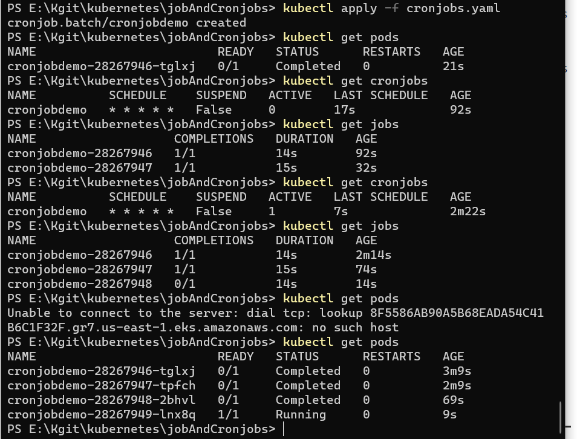

### jobs:
One time task is done by jobs.Job completes its task and goes in to completed state.
### Cronjobs :
the job which has moe than one task is called CronJob.For example these are done for every min or every day or every hour.Cronjobs goes on doing after completing its task depending on we have written in the job spec.
 


